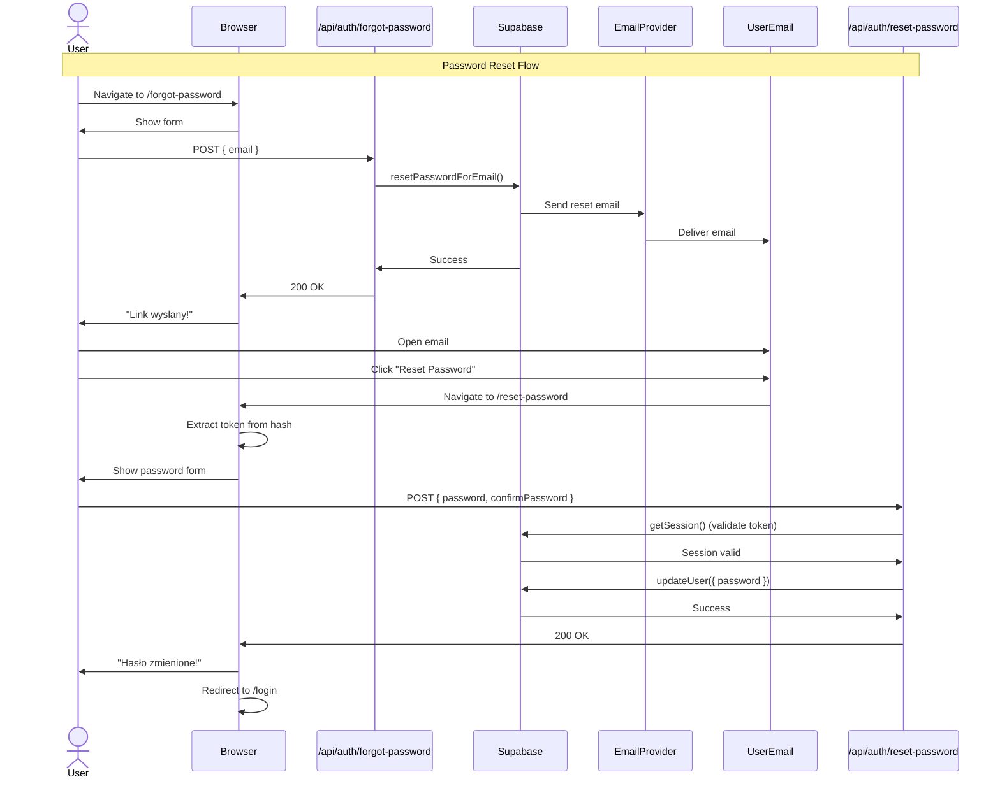

# 🔐 Reset Hasła (Password Recovery) - Implementacja

## ✅ Zaimplementowane Komponenty

### **1. Endpoint: Forgot Password**

**Plik:** `src/pages/api/auth/forgot-password.ts`

- `POST /api/auth/forgot-password`
- Przyjmuje: `{ email: string }`
- Wywołuje: `supabase.auth.resetPasswordForEmail()`
- Wysyła email z linkiem resetującym
- **Security:** Zawsze zwraca 200 (brak email enumeration)

### **2. Endpoint: Reset Password**

**Plik:** `src/pages/api/auth/reset-password.ts`

- `POST /api/auth/reset-password`
- Przyjmuje: `{ password: string, confirmPassword: string }`
- Wywołuje: `supabase.auth.updateUser({ password })`
- Wymaga ważnej sesji z tokena resetującego
- Zwraca: 200 (sukces), 401 (token wygasł), 400 (walidacja)

### **3. Strona: Forgot Password**

**Plik:** `src/pages/forgot-password.astro`

- Renderuje `ForgotPasswordForm`
- Prosty layout z gradientem

### **4. Komponent: ForgotPasswordForm**

**Plik:** `src/components/auth/ForgotPasswordForm.tsx`

- Formularz z polem email
- Walidacja client-side
- Wywołanie API `/api/auth/forgot-password`
- Ekran sukcesu: "Link został wysłany!"

### **5. Strona: Reset Password**

**Plik:** `src/pages/reset-password.astro`

- Renderuje `ResetPasswordForm`
- Token przychodzi w URL hash (Supabase)

### **6. Komponent: ResetPasswordForm**

**Plik:** `src/components/auth/ResetPasswordForm.tsx`

- Wykrywa token z URL hash (client-side)
- Formularz: nowe hasło + potwierdzenie
- Walidacja client-side
- Wywołanie API `/api/auth/reset-password`
- Redirect do `/login?message=password_reset_success`

### **7. Komunikat w LoginForm**

**Plik:** `src/components/auth/LoginForm.tsx`

- Dodano: `password_reset_success` message
- "Hasło zostało zmienione! Możesz się teraz zalogować."

---

## 🔄 Flow Resetowania Hasła

### **Krok 1: Zapomniałem Hasła**

```
User → /forgot-password
  ↓
Wpisuje email
  ↓
POST /api/auth/forgot-password
  ↓
Supabase.auth.resetPasswordForEmail()
  ↓
Email wysłany z linkiem
  ↓
Ekran sukcesu: "Sprawdź email!"
```

### **Krok 2: Kliknięcie Linku w Emailu**

```
User klika link w emailu
  ↓
Supabase redirect:
http://localhost:3000/reset-password#access_token=XXX&type=recovery
  ↓
ResetPasswordForm wykrywa token z URL hash
  ↓
Wyświetla formularz nowego hasła
```

### **Krok 3: Ustawienie Nowego Hasła**

```
User wpisuje nowe hasło + potwierdzenie
  ↓
POST /api/auth/reset-password
  ↓
Supabase.auth.updateUser({ password })
  ↓
Hasło zmienione
  ↓
Redirect: /login?message=password_reset_success
  ↓
User loguje się nowym hasłem
```

---

## 🔒 Bezpieczeństwo

### **1. Email Enumeration Protection**

**Problem:** Atakujący może sprawdzać czy email istnieje w bazie.

**Rozwiązanie:**

```typescript
// ZAWSZE zwracamy sukces, nawet jeśli email nie istnieje
const successResponse = {
  message: "Jeśli konto z tym adresem email istnieje, został wysłany link.",
};
```

**Efekt:** Atakujący nie wie czy email istnieje czy nie.

---

### **2. Token Expiration**

**Supabase:**

- Link resetujący wygasa po **24 godzinach** (domyślnie)
- Token można użyć **tylko raz**

**Implementacja:**

```typescript
// Endpoint sprawdza czy session istnieje (token ważny)
const {
  data: { session },
} = await locals.supabase.auth.getSession();

if (!session) {
  return error("Link wygasł");
}
```

---

### **3. Password Validation**

**Client-side:**

- Hasło minimum 6 znaków
- Hasła muszą się zgadzać

**Server-side:**

- Zod schema validation
- Supabase built-in password requirements

---

## 🧪 Testowanie

### **Test 1: Pełny Flow Reset Hasła**

**Krok 1: Wyślij Link**

```bash
1. Otwórz: http://localhost:3000/forgot-password
2. Email: test@tripbook.pl
3. Submit

4. ✅ Ekran sukcesu: "Link został wysłany!"
```

**Krok 2: Sprawdź Email**

```bash
1. Otwórz skrzynkę: test@tripbook.pl
2. Szukaj: "Reset your password" (lub polskiego szablonu)
3. ⚠️ Sprawdź SPAM jeśli nie ma w inbox
```

**Krok 3: Kliknij Link**

```bash
1. Kliknij link w emailu
2. URL: http://localhost:3000/reset-password#access_token=XXX&type=recovery
3. ✅ Formularz nowego hasła
```

**Krok 4: Ustaw Nowe Hasło**

```bash
1. Nowe hasło: newpassword123
2. Potwierdzenie: newpassword123
3. Submit

4. ✅ "Hasło zostało zmienione!"
5. ✅ Automatyczny redirect do /login
```

**Krok 5: Zaloguj Się**

```bash
1. Email: test@tripbook.pl
2. Hasło: newpassword123 (nowe!)
3. Submit

4. ✅ Zalogowany! Redirect do /trips
```

---

### **Test 2: Email Nie Istnieje**

```bash
1. /forgot-password
2. Email: nonexistent@example.com
3. Submit

✅ Sukces: "Jeśli konto istnieje, link został wysłany"
   (bezpieczeństwo - brak informacji czy email istnieje)
```

---

### **Test 3: Link Wygasł**

```bash
1. Użyj linku starszego niż 24h
   LUB
   Użyj linku po raz drugi

2. /reset-password#access_token=OLD_TOKEN

✅ Error: "Link wygasł. Wyślij nowy link."
✅ Przyciski: "Wyślij nowy link" | "Wróć do logowania"
```

---

### **Test 4: Walidacja Hasła**

**Hasła różne:**

```bash
Password: test123
Confirm: test456

❌ "Hasła nie są identyczne"
```

**Hasło za krótkie:**

```bash
Password: test

❌ "Hasło musi mieć minimum 6 znaków"
```

---

## 📧 Konfiguracja Email Template w Supabase

### **1. Przejdź do Dashboard**

```
Supabase Dashboard → Authentication → Email Templates → Reset Password
```

### **2. Domyślny Szablon (Angielski)**

```html
<h2>Reset Password</h2>
<p>Follow this link to reset the password for your user:</p>
<p><a href="{{ .ConfirmationURL }}">Reset Password</a></p>
```

### **3. Zalecany Szablon (Polski, Branded)**

```html
<!DOCTYPE html>
<html>
  <head>
    <meta charset="UTF-8" />
    <meta name="viewport" content="width=device-width, initial-scale=1.0" />
  </head>
  <body
    style="font-family: -apple-system, BlinkMacSystemFont, 'Segoe UI', Roboto, sans-serif; line-height: 1.6; color: #333; max-width: 600px; margin: 0 auto; padding: 20px;"
  >
    <div
      style="background: linear-gradient(135deg, #667eea 0%, #764ba2 100%); padding: 30px; text-align: center; border-radius: 10px 10px 0 0;"
    >
      <h1 style="color: white; margin: 0; font-size: 28px;">Resetowanie hasła 🔐</h1>
    </div>

    <div style="background: #f9fafb; padding: 30px; border-radius: 0 0 10px 10px;">
      <p style="font-size: 16px; margin-bottom: 20px;">
        Otrzymaliśmy prośbę o zresetowanie hasła do Twojego konta <strong>Tripbook</strong>.
      </p>

      <p style="font-size: 16px; margin-bottom: 30px;">Aby ustawić nowe hasło, kliknij poniższy przycisk:</p>

      <div style="text-align: center; margin: 30px 0;">
        <a
          href="{{ .ConfirmationURL }}"
          style="background-color: #4F46E5; color: white; padding: 14px 32px; text-decoration: none; border-radius: 8px; display: inline-block; font-weight: 600; font-size: 16px;"
        >
          Zresetuj hasło
        </a>
      </div>

      <p style="font-size: 14px; color: #6b7280; margin-top: 30px;">
        Jeśli przycisk nie działa, skopiuj i wklej ten link do przeglądarki:
      </p>
      <p
        style="font-size: 12px; color: #9ca3af; word-break: break-all; background: white; padding: 10px; border-radius: 5px; border: 1px solid #e5e7eb;"
      >
        {{ .ConfirmationURL }}
      </p>

      <hr style="border: none; border-top: 1px solid #e5e7eb; margin: 30px 0;" />

      <p style="font-size: 13px; color: #6b7280;">⏱️ <strong>Ważne:</strong> Ten link wygasa po 24 godzinach.</p>

      <p style="font-size: 13px; color: #6b7280;">
        🔒 Jeśli to nie Ty zażądałeś zresetowania hasła, zignoruj ten email. Twoje hasło pozostanie bez zmian.
      </p>

      <p style="font-size: 14px; color: #374151; margin-top: 30px;">
        Pozdrawiamy,<br />
        <strong>Zespół Tripbook</strong>
      </p>
    </div>

    <div style="text-align: center; padding: 20px; font-size: 12px; color: #9ca3af;">
      <p>© 2024 Tripbook. Wszystkie prawa zastrzeżone.</p>
    </div>
  </body>
</html>
```

**Kliknij Save.**

---

## 🔧 Konfiguracja Redirect URL

### **Dlaczego To Ważne**

Supabase musi wiedzieć, gdzie przekierować użytkownika po kliknięciu linku.

### **Konfiguracja**

**1. Supabase Dashboard:**

```
Authentication → URL Configuration
```

**2. Site URL:**

```
Development: http://localhost:3000
Production: https://twoja-domena.com
```

**3. Redirect URLs:**

```
http://localhost:3000/**,
http://localhost:4321/**,
https://twoja-domena.com/**
```

### **Redirect URL w Kodzie**

W `forgot-password.ts`:

```typescript
await locals.supabase.auth.resetPasswordForEmail(email, {
  redirectTo: `${new URL(request.url).origin}/reset-password`,
});
```

**Efekt:**

- Development: `http://localhost:3000/reset-password#access_token=...`
- Production: `https://twoja-domena.com/reset-password#access_token=...`

---

## 🐛 Troubleshooting

### **Problem 1: Email Nie Przychodzi**

**Przyczyny:**

1. Limit Supabase (4 emaile/h na free tier)
2. Email w SPAM
3. Nieprawidłowy email provider

**Rozwiązanie:**

```bash
# Sprawdź Dashboard
1. Supabase → Authentication → Users
2. Znajdź użytkownika
3. ⋮ → "Send password recovery"

# Sprawdź logi
1. Supabase → Logs → Auth Logs
2. Szukaj: "password_recovery"
```

---

### **Problem 2: "Link Wygasł"**

**Przyczyny:**

1. Link starszy niż 24h
2. Token użyty więcej niż raz
3. Session wygasła

**Rozwiązanie:**

```bash
1. Kliknij "Wyślij nowy link"
2. Wróć do /forgot-password
3. Wpisz email ponownie
4. Użyj NOWEGO linku z emaila
```

---

### **Problem 3: "Token Not Found"**

**Przyczyna:**
URL nie zawiera `access_token` w hash.

**Poprawny URL:**

```
http://localhost:3000/reset-password#access_token=XXX&type=recovery
```

**Rozwiązanie:**

```bash
# Sprawdź czy redirect URL jest poprawny
1. Dashboard → Authentication → URL Configuration
2. Site URL = http://localhost:3000
3. Redirect URLs = http://localhost:3000/**
```

---

### **Problem 4: Redirect Po Kliknięciu Nie Działa**

**Symptom:**
Po kliknięciu linku w emailu widzisz 404 lub błąd.

**Rozwiązanie:**

```bash
# Sprawdź routes
1. Czy istnieje: src/pages/reset-password.astro ✓
2. Czy app działa: npm run dev ✓
3. Czy redirect URL zawiera /reset-password ✓

# W forgot-password.ts:
redirectTo: `${origin}/reset-password` ✓
```

---

## 📊 Diagrams

### **Sequence Diagram**



---

## ✅ Checklist Implementacji

- [x] Endpoint `POST /api/auth/forgot-password`
- [x] Endpoint `POST /api/auth/reset-password`
- [x] Strona `/forgot-password` + `ForgotPasswordForm.tsx`
- [x] Strona `/reset-password` + `ResetPasswordForm.tsx`
- [x] Token extraction z URL hash (client-side)
- [x] Email enumeration protection
- [x] Walidacja Zod (server-side)
- [x] Walidacja client-side
- [x] Komunikat "password_reset_success" w LoginForm
- [x] Redirect po sukcesie
- [x] Error handling (token wygasł, hasło za krótkie, etc.)
- [x] Dokumentacja

---

## 📝 Pliki Utworzone/Zmodyfikowane

### **Nowe:**

```
src/pages/api/auth/forgot-password.ts     ✨ Endpoint forgot password
src/pages/api/auth/reset-password.ts      ✨ Endpoint reset password
```

### **Zmodyfikowane:**

```
src/components/auth/ForgotPasswordForm.tsx  ✏️ API integration
src/components/auth/ResetPasswordForm.tsx   ✏️ API integration + token extraction
src/components/auth/LoginForm.tsx           ✏️ +password_reset_success message
src/pages/reset-password.astro              ✏️ Updated comment
```

---

## 🎯 Spójność z Innymi Funkcjami Auth

| Feature       | Forgot Password              | Register               | Login                  |
| ------------- | ---------------------------- | ---------------------- | ---------------------- |
| **Endpoint**  | `/api/auth/forgot-password`  | `/api/auth/register`   | `/api/auth/login`      |
| **Walidacja** | Zod schema                   | Zod schema             | Zod schema             |
| **Supabase**  | `resetPasswordForEmail()`    | `signUp()`             | `signInWithPassword()` |
| **Email**     | ✅ Wysyłany                  | ✅ Wysyłany (optional) | ❌ Nie                 |
| **Redirect**  | `/reset-password`            | `/login`               | `/trips`               |
| **Security**  | Email enumeration protection | Email confirmation     | Session management     |

---

**Status:** ✅ Reset hasła zaimplementowany!  
**Data:** 2024-12-15  
**Zgodność:** PRD US-001 ✓
