# Diagram Przepływu Autentykacji - Tripbook

```mermaid
sequenceDiagram
    autonumber

    participant Browser as Przeglądarka
    participant Middleware as Middleware Astro
    participant API as API Astro
    participant Supabase as Supabase Auth
    participant DB as Baza Danych

    Note over Browser,DB: Scenariusz 1: Pierwszy dostęp

    Browser->>Middleware: GET /
    activate Middleware
    Middleware->>Supabase: getSession()
    Supabase-->>Middleware: null

    alt Niezalogowany
        Middleware->>Browser: Renderuj stronę główną
        Note over Browser: Panel: Zaloguj / Zarejestruj
    else Zalogowany
        Middleware->>Browser: Redirect /trips
    end
    deactivate Middleware

    Note over Browser,DB: Scenariusz 2: Rejestracja

    Browser->>Browser: Klik Zarejestruj się
    Browser->>Browser: Wypełnia formularz
    Browser->>API: POST /api/auth/register
    activate API
    API->>API: Walidacja Zod

    alt Błąd walidacji
        API-->>Browser: 400 Bad Request
    else Walidacja OK
        API->>Supabase: signUp(email, password)
        activate Supabase

        alt Email istnieje
            Supabase-->>API: Error
            API-->>Browser: 409 Conflict
        else Sukces
            Supabase->>DB: INSERT auth.users
            DB-->>Supabase: OK
            Supabase-->>API: user created
            deactivate Supabase
            API-->>Browser: 201 Created
            Browser->>Browser: Redirect /login
        end
    end
    deactivate API

    Note over Browser,DB: Scenariusz 3: Logowanie

    Browser->>Browser: Wypełnia formularz logowania
    Browser->>API: POST /api/auth/login
    activate API
    API->>API: Walidacja Zod
    API->>Supabase: signInWithPassword()
    activate Supabase

    alt Błędne dane
        Supabase-->>API: Invalid credentials
        API-->>Browser: 401 Unauthorized
    else Sukces
        Supabase->>Supabase: Generuj JWT tokeny
        Supabase-->>API: session + user
        deactivate Supabase
        API->>API: Ustaw cookies httpOnly
        API-->>Browser: 200 OK
        Browser->>Browser: Redirect /trips
    end
    deactivate API

    Note over Browser,DB: Scenariusz 4: Dostęp chroniony

    Browser->>Middleware: GET /trips
    activate Middleware
    Middleware->>Middleware: Odczyt cookies
    Middleware->>Supabase: getSession()
    activate Supabase

    alt Token wygasły
        Supabase->>Supabase: Użyj refresh token
        alt Refresh OK
            Supabase->>Supabase: Nowy access token
            Supabase-->>Middleware: Nowa sesja
            Middleware->>Middleware: Aktualizuj cookie
        else Refresh wygasły
            Supabase-->>Middleware: null
            Middleware->>Browser: Redirect /login
        end
    else Token ważny
        Supabase-->>Middleware: session + user
        deactivate Supabase
        Middleware->>Middleware: Dodaj do context.locals
        Middleware->>Browser: Renderuj /trips
        deactivate Middleware

        Browser->>API: GET /api/trips
        activate API
        API->>API: Pobierz user_id z sesji
        API->>DB: SELECT trips WHERE user_id
        activate DB
        DB-->>API: Lista wycieczek
        deactivate DB
        API-->>Browser: 200 OK + trips
        deactivate API
    end

    Note over Browser,DB: Scenariusz 5: Wylogowanie

    Browser->>Browser: Klik Wyloguj
    Browser->>API: POST /api/auth/logout
    activate API
    API->>Supabase: signOut()
    activate Supabase
    Supabase->>Supabase: Unieważnij sesję
    Supabase-->>API: OK
    deactivate Supabase
    API->>API: Usuń cookies
    API-->>Browser: 200 OK
    deactivate API
    Browser->>Browser: Redirect /login

    Note over Browser,DB: Scenariusz 6: Reset hasła

    Browser->>Browser: GET /forgot-password
    Browser->>API: POST /api/auth/forgot-password
    activate API
    API->>Supabase: resetPasswordForEmail()
    activate Supabase
    Supabase->>Supabase: Generuj token + wyślij email
    Supabase-->>API: OK
    deactivate Supabase
    API-->>Browser: 200 OK
    deactivate API

    Note over Browser: Użytkownik klika link w emailu

    Browser->>Browser: GET /reset-password?token=xyz
    Browser->>API: POST /api/auth/reset-password
    activate API
    API->>Supabase: updateUser(password)
    activate Supabase

    alt Token nieprawidłowy
        Supabase-->>API: Invalid token
        API-->>Browser: 400 Bad Request
    else Token OK
        Supabase->>DB: UPDATE auth.users
        DB-->>Supabase: OK
        Supabase-->>API: Success
        deactivate Supabase
        API-->>Browser: 200 OK
        Browser->>Browser: Redirect /login
    end
    deactivate API

    Note over Browser,DB: Scenariusz 7: Ochrona API

    Browser->>API: POST /api/trips
    activate API
    API->>Supabase: getSession()
    activate Supabase
    Supabase-->>API: session + user
    deactivate Supabase

    alt Brak sesji
        API-->>Browser: 401 Unauthorized
    else Sesja OK
        API->>API: Walidacja danych
        API->>DB: INSERT trips + user_id
        activate DB
        DB-->>API: Trip created
        deactivate DB
        API-->>Browser: 201 Created
    end
    deactivate API
```

## Opis Scenariuszy

### Scenariusz 1: Pierwszy dostęp do aplikacji

- Użytkownik wchodzi na `/` (root)
- Middleware sprawdza sesję
- Niezalogowani widzą panel wyboru (Zaloguj/Zarejestruj)
- Zalogowani są przekierowywani do `/trips`

### Scenariusz 2: Rejestracja nowego użytkownika

- Formularz: email, hasło, potwierdzenie hasła
- Walidacja Zod na serwerze
- Supabase tworzy użytkownika w `auth.users`
- Przekierowanie na `/login`

### Scenariusz 3: Logowanie użytkownika

- Formularz: email, hasło
- Supabase weryfikuje credentials
- Generowanie JWT tokenów (access + refresh)
- Tokeny zapisywane w httpOnly cookies
- Przekierowanie na `/trips`

### Scenariusz 4: Dostęp do chronionego zasobu

- Middleware sprawdza sesję przy każdym żądaniu
- Odczyt tokenów z cookies
- Automatyczne odświeżanie wygasłych tokenów
- Dostęp do API `/api/trips` z user_id z sesji
- Filtrowanie wycieczek po user_id

### Scenariusz 5: Wylogowanie

- Kliknięcie przycisku "Wyloguj" w UserMenu
- Supabase unieważnia sesję
- Usunięcie cookies z tokenami
- Przekierowanie na `/login`

### Scenariusz 6: Reset hasła

- Użytkownik wpisuje email na `/forgot-password`
- Supabase wysyła email z tokenem
- Użytkownik klika link → `/reset-password?token=...`
- Ustawienie nowego hasła
- Przekierowanie na `/login`

### Scenariusz 7: Ochrona API wycieczek

- Wszystkie endpointy `/api/trips/*` wymagają sesji
- User_id pobierany z sesji (nie z request body)
- Automatyczne filtrowanie po user_id
- Zwracanie 401 dla niezalogowanych

## Kluczowe Elementy

### Tokeny i Sesje

- **Access Token**: JWT, ważny 1h, httpOnly cookie
- **Refresh Token**: Ważny 30 dni, automatyczne odnawianie
- **Cookies**: httpOnly, secure (HTTPS), sameSite: 'lax'

### Bezpieczeństwo

- Middleware sprawdza sesję przy każdym żądaniu
- Chronione trasy: `/trips/*`
- Ochrona API: wszystkie `/api/trips/*`
- RLS w bazie danych (opcjonalnie)
- Walidacja Zod na serwerze

### Komponenty

**Frontend:**

- LoginForm.tsx
- RegisterForm.tsx
- ForgotPasswordForm.tsx
- ResetPasswordForm.tsx
- UserMenu.tsx

**Backend:**

- src/middleware/index.ts
- src/pages/api/auth/\*.ts
- src/lib/schemas/authSchema.ts

**Infrastruktura:**

- Supabase Auth (JWT, sesje)
- Supabase DB (auth.users, trips)
- Cookies (httpOnly, secure)
